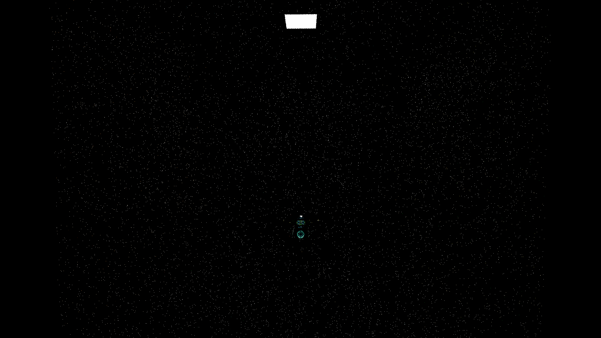
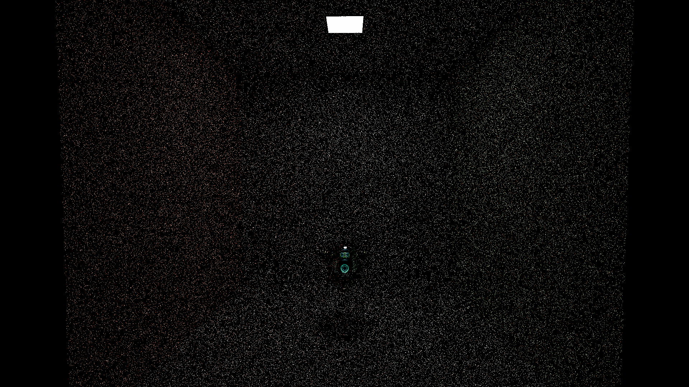
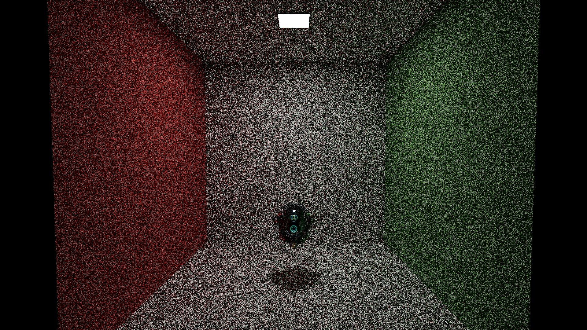
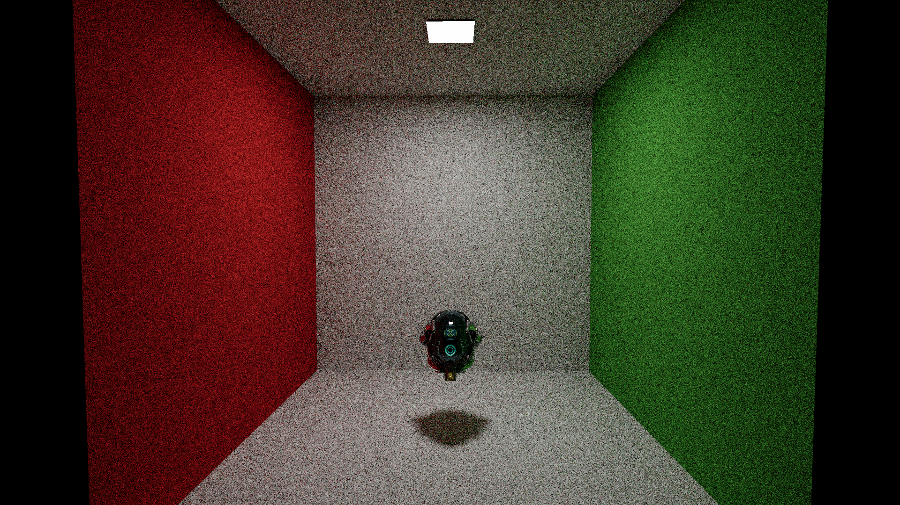
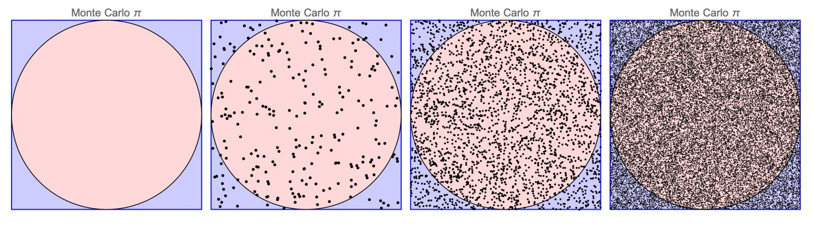
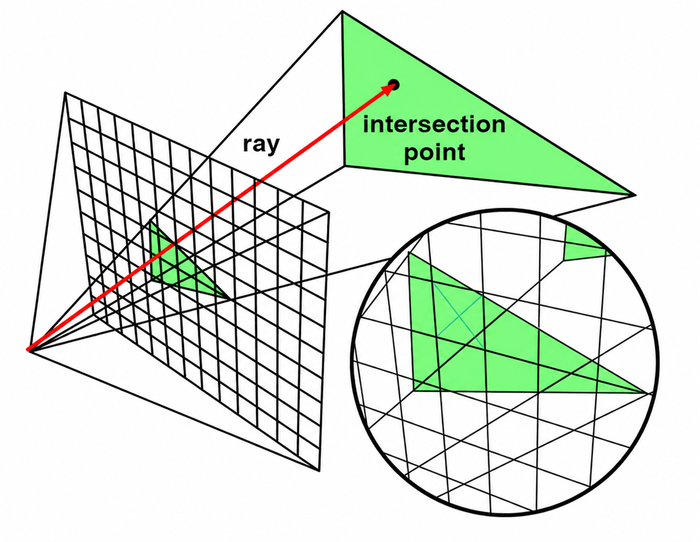
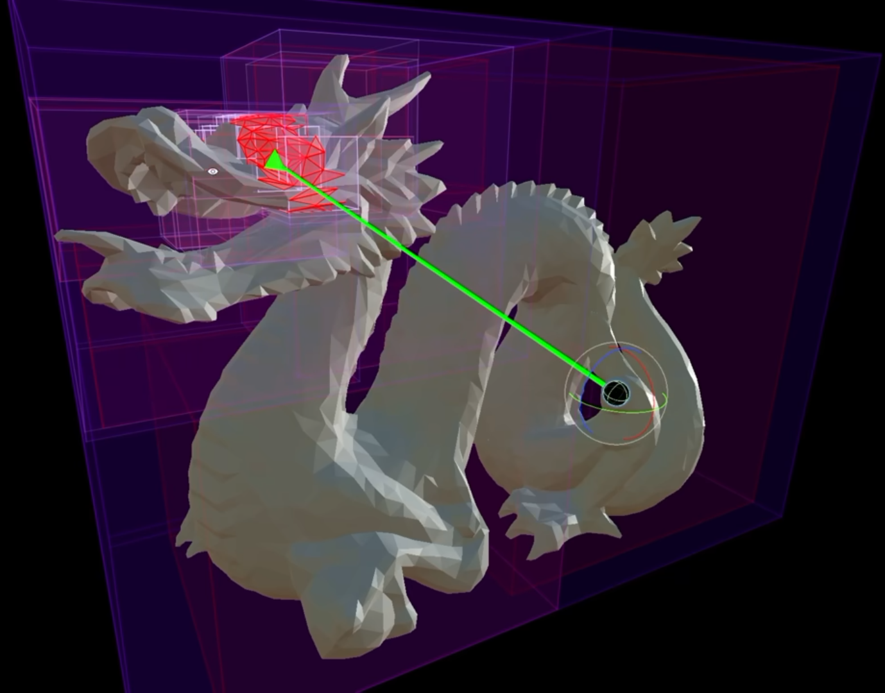
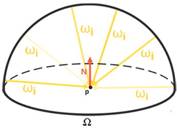
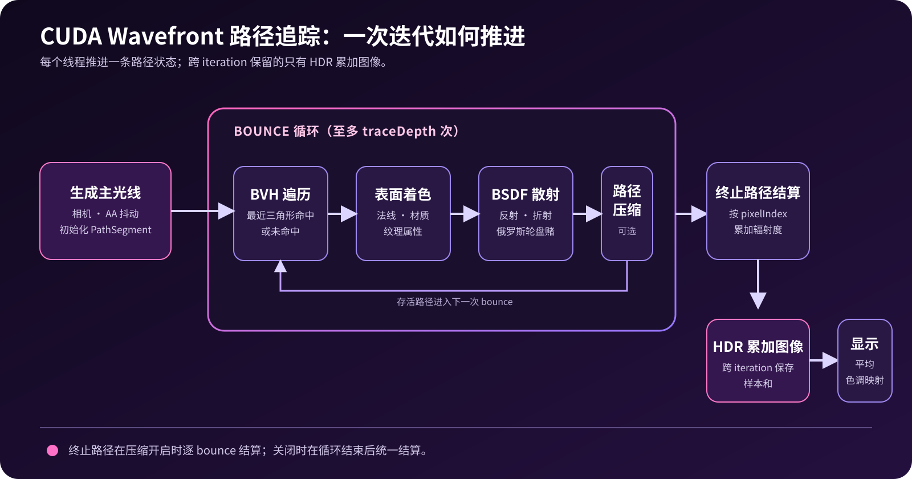

# 路径追踪专栏 Ep.02：随机光线，为什么能收敛成一张图？

路径追踪不是“向场景里乱射光线”。它用随机光路估计每个像素的光照积分；单个样本不可靠，但大量样本的平均会收敛。

本篇只讨论基础路径追踪：从 BSDF 采样延续一条路径。直接光照、NEE 和 MIS 留到后续专题。

## 1. 先看收敛

同一机位下，一个像素每个 iteration 只得到一条完整路径样本。噪点不是后处理缺陷，而是有限样本的统计方差。

| 1 spp | 10 spp | 100 spp | 1000 spp |
| --- | --- | --- | --- |
|  |  |  |  |

通常有：

\[
\text{noise} \propto \frac{1}{\sqrt{N}}
\]

样本数增加四倍，噪点标准误差才约减半。这就是路径追踪“越干净越贵”的原因。

## 2. 蒙特卡洛积分：用随机样本估计连续量



图中在边长为 2 的正方形内均匀撒点。圆内点数占比近似为圆面积与正方形面积之比：

\[
\pi \approx 4\frac{N_{\text{inside}}}{N}
\]

这正是蒙特卡洛积分的最小例子。更一般地，若样本 \(X_k\) 按 PDF \(p(x)\) 生成：

\[
\int f(x)\,dx
\approx
\frac{1}{N}\sum_{k=1}^{N}\frac{f(X_k)}{p(X_k)}
\]

分母 \(p(X_k)\) 不是装饰：抽样概率更高的样本必须按其概率校正，结果才不会偏向“更容易被抽到”的区域。

## 3. 光栅化、光线追踪与路径追踪


| 技术 | 主要问题 | 核心操作 |
| --- | --- | --- |
| 光栅化 | 哪个三角形覆盖像素 | 三角形投影到屏幕并填充像素 |
| 光线追踪 | 一条光线首先打到哪里 | 射线与场景求最近交点 |
| 路径追踪 | 像素最终带回多少光 | 重复“求交 → 按材质采样下一方向”，再做蒙特卡洛平均 |



光线追踪本身只是几何查询；路径追踪反复使用这项查询，才获得反射、折射、间接光等多次传播效应。



## 4. 渲染方程如何变成路径权重

表面点朝相机方向离开的光为：

\[
L_o(p,\omega_o)=L_e(p,\omega_o)+
\int_{\Omega} f_r(p,\omega_i,\omega_o)L_i(p,\omega_i)
(\omega_i\cdot n)\,d\omega_i
\]

其中 \(L_e\) 是自发光，\(L_i\) 是入射光，\(f_r\) 是 BSDF/BRDF，\(\omega_i\cdot n\) 是余弦项。\(\Omega\) 是连续半球，无法逐方向穷举；路径追踪每次只采样一个方向，再以大量路径平均估计积分。



每次 BSDF 采样后，路径吞吐量更新为：

\[
\beta_{k+1}=
\beta_k\frac{f_r(\omega_i,\omega_o)\cos\theta}{p(\omega_i)}
\]

对余弦加权的 Lambert 漫反射：

\[
f_r=\frac{\text{albedo}}{\pi},\qquad
p(\omega_i)=\frac{\cos\theta}{\pi}
\quad\Longrightarrow\quad
\frac{f_r\cos\theta}{p(\omega_i)}=\text{albedo}
\]

这就是重要性采样：让 PDF 接近被积函数的重要部分，降低方差，而非改变正确答案。

## 5. CUDA 中的一条路径

本项目每个像素在每轮开始时初始化一份路径状态：

```cpp
segment.throughput = glm::vec3(1.0f);
segment.accumulatedRadiance = glm::vec3(0.0f);
segment.remainingBounces = traceDepth;
```

- `throughput`：截至当前 bounce 的路径权重 \(\beta\)。
- `accumulatedRadiance`：这条路径已带回的辐射度。
- `remainingBounces`：对无限光路设置的工程上限。

路径终止时，结果结算回原始像素：

```cpp
image[path.pixelIndex] += path.accumulatedRadiance;
```

跨 iteration 保存的是 HDR 累加和；显示前除以样本数，再进行 Bloom、ACES 色调映射和 sRGB 编码。



这是一种 wavefront 组织方式：同一阶段让大量活跃路径做相同工作。一个线程推进一条路径状态，而不是独占渲染一张图。

## 结语

路径追踪的核心不是“随机”，而是**带 PDF 校正的随机估计**。每条路径只观察到渲染方程的一小部分；累计足够多的独立样本后，像素值才逐步稳定。

下一篇：当场景有大量三角形时，如何用世界空间 BVH 避免每条光线遍历全部几何？
